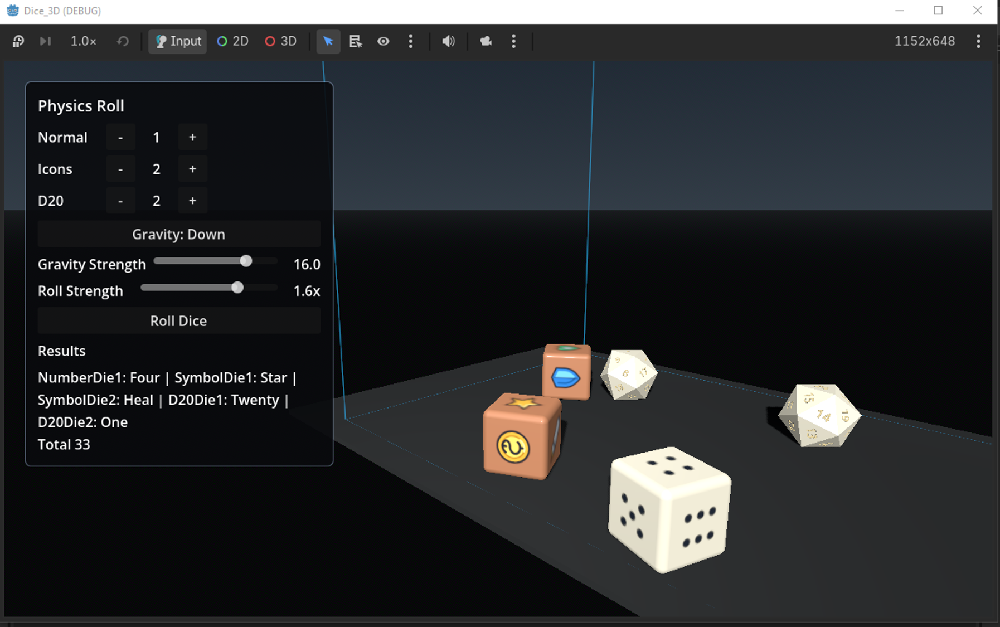
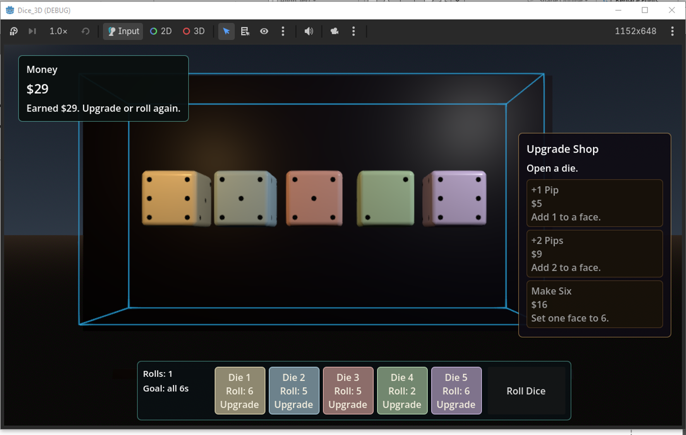

# Dice 3D

Dice 3D is a Godot 4.7 addon for modular 3D dice.

There are two main nodes:

- `DiceCinematicRoller3D` - an animation roll box. Use this when you want the die to bounce, spin, and settle in a clean UI-friendly way. You can pass in a result, or let the roller choose one randomly. It does not use physics.
- `DiceRollBox3D` - a physics roll box. Use this when you want real dice motion with gravity, collisions, friction, bounce, roll strength, and automatic top-face detection.

Both nodes use `DiceDieDefinition3D` resources. A dice definition describes the die shape, faces, materials, and roll defaults. Create a definition once, then assign it to either roll node.

## Installation

Copy `addons/dice_3d` into a Godot 4.7 project, then enable **Dice 3D** from **Project > Project Settings > Plugins**.

## Included Demos

- `res://addons/dice_3d/demo/animation_roll_demo.tscn` - a clean UI demo using `DiceCinematicRollPanel` and `DiceCinematicRoller3D`.
- `res://addons/dice_3d/demo/physics_roll_demo.tscn` - a UI-driven physics demo with a wide/tall roll box, movable camera, inspector-authored dice definitions, gravity direction, gravity strength, roll strength, and dice type controls.
- `res://addons/dice_3d/demo/pips_to_six_demo.tscn` - a fullscreen dice-upgrade game where rolls earn money, shop upgrades are dragged onto die faces, and the goal is to roll all sixes.
- `res://addons/dice_3d/demo/dice_definitions_example.gd` - a compact code example showing how to build dice definitions for normal dice, icon dice, and D20s.

The UI demos keep interface controls in the UI layer. The dice themselves remain 3D nodes, either in the main 3D scene or inside a `SubViewportContainer` when the UI needs to frame the 3D view.

## Screenshots





## Dice Definitions

`DiceDieDefinition3D` is the main setup resource. It describes the die shape, body style, material/color settings, roll defaults, and face resources.

```gdscript
var definition := DiceDieDefinition3D.numbered_d6()
definition.display_name = "HeroDie"
definition.body_shape = DiceDie3D.BodyShape.ROUNDED
definition.body_color = Color(1.0, 0.98, 0.92)
definition.body_roughness = 0.34
definition.body_specular = 0.48
definition.body_clearcoat = 0.28
definition.body_clearcoat_roughness = 0.18
```

Custom faces can carry values, stable IDs, display names, textures, materials, meshes, scenes, and metadata.

```gdscript
var action_die := DiceDieDefinition3D.custom("ActionDie", [
	DiceFace3D.new_face(1, &"attack", preload("res://faces/attack.svg"), "Attack"),
	DiceFace3D.new_face(6, &"blank", preload("res://faces/blank.svg"), "Blank"),
	DiceFace3D.new_face(2, &"shield", preload("res://faces/shield.svg"), "Shield"),
	DiceFace3D.new_face(5, &"star", preload("res://faces/star.svg"), "Star"),
	DiceFace3D.new_face(3, &"heal", preload("res://faces/heal.svg"), "Heal"),
	DiceFace3D.new_face(4, &"coin", preload("res://faces/coin.svg"), "Coin"),
])
```

The shipped shapes are D6 and D20. D6 dice can use sharp generated cube bodies or the bundled rounded D6 mesh. D20 dice use generated polyhedral bodies and generated face labels by default.

## Animation Rolls

Use `DiceCinematicRoller3D` when you want a controlled, non-physics roll presentation. You can pass in a chosen result, or call `roll()` without a result and let the roller choose a random face. The die stays in a controlled stage, bounces vertically, spins, then settles to the final face.

```gdscript
@onready var roller: DiceCinematicRoller3D = $DiceCinematicRoller3D

func _ready() -> void:
	roller.spin_clearance = 1.4
	roller.layout_tween_duration = 0.3
	roller.bounce_height = 1.4
	roller.spin_turns = 14.0
	roller.align_flat_bottom_on_land = true
	roller.idle_spin_enabled = true

	var die := roller.create_die(DiceDieDefinition3D.numbered_d6())
	roller.roll_finished.connect(_on_roll_finished)
	roller.roll(die, 6)

func _on_roll_finished(result: DiceRollResult) -> void:
	print("Presented ", result.display_name)
```

`roll()` accepts a requested value, face slot, `face_id`, `DiceFace3D`, or dictionary such as `{"value": 4}`. If no result is supplied, the roller chooses a random face and still returns a normal `DiceRollResult`.

### Drop-In Animation UI

Instance `res://addons/dice_3d/ui/dice_cinematic_roll_panel.tscn` under a `CanvasLayer` or any `Control` container, then point it at a `DiceCinematicRoller3D`.

```gdscript
@onready var roll_panel: DiceCinematicRollPanel = $CanvasLayer/DiceCinematicRollPanel

func _ready() -> void:
	roll_panel.roller_path = NodePath("../../DiceCinematicRoller3D")
	roll_panel.normal_die_definition = DiceDieDefinition3D.numbered_d6()
	roll_panel.icon_die_definition = preload("res://addons/dice_3d/demo/assets/symbol_die_definition.tres")
	roll_panel.d20_die_definition = DiceDieDefinition3D.numbered_d20()
	roll_panel.max_dice = 9
	roll_panel.normal_dice_count = 1
	roll_panel.icon_dice_count = 1
	roll_panel.d20_dice_count = 1
```

The panel includes Normal, Icons, and D20 rows, plus/minus controls, a roll button, and a results list. It is intentionally small so it is easy to copy into game-specific UI.

## Physics Rolls

Use `DiceRollBox3D` when you want real dice motion. It builds a closed roll box by default so dice stay contained while gravity, collisions, friction, bounce, and spin determine the final face.

```gdscript
@onready var roll_box: DiceRollBox3D = $DiceRollBox3D

func _ready() -> void:
	roll_box.bottom_side = DiceRollBox3D.BoxSide.NEG_Y
	roll_box.dice_friction = 0.85
	roll_box.dice_bounce = 0.12
	roll_box.default_roll_impulse_min = 8.0
	roll_box.default_roll_impulse_max = 12.0
	roll_box.default_initial_spin_min = 10.0
	roll_box.default_initial_spin_max = 18.0
	roll_box.roll_source = DiceRollBox3D.RollSource.POS_X_NEG_Z_CORNER
	roll_box.reroll_unflat_results = true
	roll_box.roll_finished.connect(_on_roll_finished)

	var definition := DiceDieDefinition3D.numbered_d6()
	definition.display_name = "PlayerDie"
	definition.body_shape = DiceDie3D.BodyShape.ROUNDED
	roll_box.add_die_definition(definition, true)

func roll_player_die() -> void:
	roll_box.roll_all()

func _on_roll_finished(result: DiceRollResult) -> void:
	print(result.die.name, " rolled ", result.display_name)
	print("flat: ", result.is_flat, " score: ", result.flatness)
```

By default, a roll starts near the selected `roll_source` and launches toward the box center. Leave `DiceRollOptions.impulse` at zero to use the generated center-aimed throw, then tune `default_roll_impulse_min/max`, `default_initial_spin_min/max`, `roll_source_spread`, and `roll_target_spread`.

`bottom_side` controls the box's gravity direction. `gravity_strength` controls how strong that gravity is.

## License

Dice 3D is released under CC0 1.0 Universal. See [LICENSE.md](LICENSE.md).

## Shape And Face Notes

Dice rendering goes through a shape-data layer so face anchors, result alignment, and top-face lookup are not hardcoded to cubes.

- D6 faces use slots `+Y`, `-Y`, `+Z`, `-Z`, `+X`, and `-X`.
- Default D6 values are `[1, 6, 2, 5, 3, 4]`, so opposite sides sum to 7.
- D20 faces use slots `F1` through `F20`.
- `edge_length` scales the visible mesh and collision shape together.
- `face_decoration_offset` and `face_decoration_scale` control how face visuals sit on the body.

Physics D6 dice still use a simple box collision shape for stable rolling, even when the visible body uses the rounded mesh.

## Acknowledgements

Generative AI was used in the creation of this plugin.
Sound assets are from [Kenney](https://kenney.nl/assets) and are CC0/public domain.
Textures are from [Poly Haven](https://polyhaven.com/) and are CC0.
